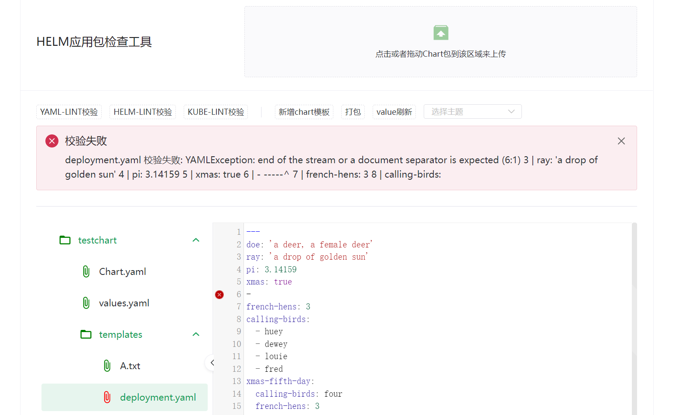

  ChartChecker

#### 背景介绍
- 问题定位：
 工作中使用chart包部署k8s应用，在写chart模板时经常遇到yaml模板格式有问题，但是helm的日志显示的文件的行数是压缩后的行数没法与实际的yaml文件行数对应导致问题难以定位。

- 模板生成：
chart包的组成相对固定，且原生的helm命令支持生成chart模板，想利用helm和前端结合更好的写chart模板。

- 集成更多k8s相关插件：k8s与很多好用的插件比如kube-lint可以检查模板中可能存在的安全，配置问题。结合这些插件可以更好的发现模板的问题。

#### 当前实现的功能
- 打开/拖入文件夹显示：支持打开/拖拽文件夹显示文件的内容。

- yaml-lint：利用js的yaml-lint可以自动检查打开的yaml文件格式是否有问题。

   

#### TODO
还有很多功能要做啦
